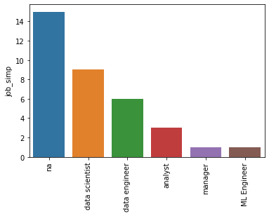
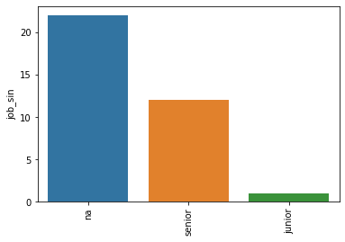
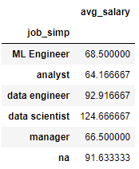
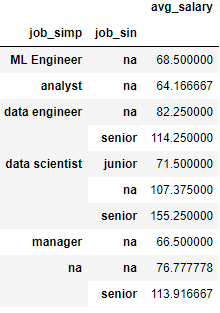
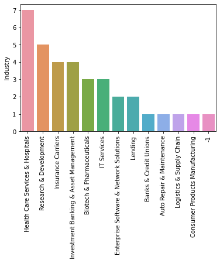
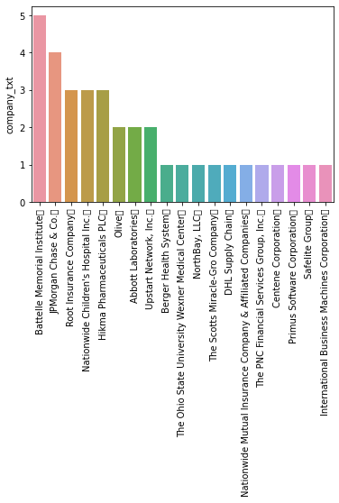
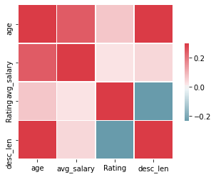

# Data Science Job Position Organizer: Project Overview

* Created a tool that estimates data science salaries (MAE ~ $12k) to help data scientists negotiate their income when they get a job

* Scraped over 1000 job descriptions using python and selenium

* Engineered features from the text of each job description to quantify the value companies put on python, excel, aws, and spark.

* Optimized Linear, Lasso, and Random Forest Regressors using RidsearchCV to reach the best model.

* Built a client facing API using flask.

## Code and Resources used
* **Python:** 3.7.6 
* **Packages:** pandas, numpy, sklearn, matplotlib, seaborn, selenium, flask, json, pickle
* **For Web Framework Requirements:** pip install -r requirements.txt
* **Guided DS Salaries Project:** https://www.youtube.com/playlist?list=PL2zq7klxX5ASFejJj80ob9ZAnBHdz5O1t
* **Scraper Git Hub:** https://github.comarapfaik/scraping-glassdoor-selenium
* **Scraper Article:** https://towardsdatascience.com/selenium-tutorial-scraping-glassdoor-com-in-10-minutes-3d0915c6d905
* **Flask Productionization:** https://towardsdatascience.com/productionize-a-machine-learning-model-with-flask-and-heroku-8201260503d2

# Web Scraping

Tweaked the web scraper github repo (above) to scrape 1000 job postings in Columbus, Ohio from glassdoor.com. With each job, I got the following:

* Job title
* Salary Estimate
* Job Description
* Rating
* Company
* Location
* Company Founded Date
* Type of Ownership
* Industry
* Sector
* Revenue

# Data Cleaning

After scraping the data, I needed to clean it up so that it was usable for my model.  I made the following changes and created the following variables:

* Parsed numeric data out of salary
* Made columns for employer provided salary and hourly wages
* Removed rows without salary
* Parsed rating out of company text
* Made a new column for company state
* Transformed founded date into age of company
* Made columns for if different skills were listed in the job description:
..* Python
..* R
..* Excel
..* AWS
..* Spark
* Column for simplified job title and Seniority
* Column for description length
* Column for minimum degree reqirement

# EDA
I looked at the distributions of the data and the value counts for the various categorical variables.  Here are some data visualization highlights.

* 
* 
* 
* 
* 
* 
* 

# Productionization
In this step, I built a flask API endpoint that was hosted on a local webserver by following along with the TDS tutorial in the reference section above. The API endpoint takes in a request with a list of values from a job listing and returns an estimated salary.
